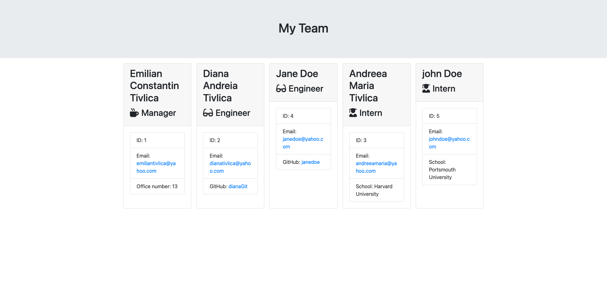

# StaffMate

This code is a Team Profile Generator that lets the user create a team based on their type "Manager", "Engineer", or "Intern". Once the user has input all of the necessary details, the HTML file will be generated in the output folder.

## Project Live Video Demo👇

* Check out the live video demo [@StaffMate](https://drive.google.com/file/d/1R22T2q9FY4P7ZfJRNlem_Jbo8aS7JdEq/view) and see how it works! 🚀

## Table of Contents

* [Installation](#installation)
* [Usage](#usage)
* [Screenshots](#screenshots)
* [Authors](#authors)
* [Skills](#skills)
* [Questions](#questions)
* [Contributing](#contributing)
* [Stack](#stack)
* [Dependencies](#dependencies)
* [License](#license)

## Screenshots

## Authors

* [@Constantin-E-T](https://github.com/Constantin-E-T/)

## Dependencies

    InquirerJS
    Path
    File System

## Installation

* Clone this repository.

        git clone https://github.com/Constantin-E-T/StaffMate.git

* Node.js and npm installed required. If not available, download them from Nodejs.org

* Navigate to the directory where you cloned the repo and install dependencies by executing the following command:

        npm install
* To run the application, execute the following command:

        node index.js

* Follow the prompts to create your team.

* Finally, navigate inside the OUTPUT folder and open TEAM.html file to view the generated team profile.

* To run tests, execute the following command:

        npm test

## Usage

This code can be used by anyone who wants to create a simple Team Profile Generator.
When running the code, users will be prompted to answer questions for each type of employee they want to add. Once all employees have been entered, an HTML file with team information will be generated.

## Contributing

Contributions are welcome! Here's how you can contribute:

Fork this repository onto your own GitHub.
Clone it to your local computer using git clone <code> Constantin-E-T/StaffMate.git </code>.
Create a new branch: <code>git checkout -b your_branch_name </code>.
Make changes to the code and test.
Submit Pull Request with description and screenshot.

## Questions

If you have any questions about this app, please contact me via email: <a> emiliantivlica@yahoo.com </a>. You can find more projects at <a> https://github.com/Constantin-E-T </a>.

## Skills

    Javascript, HTML, CSS, Python, Django

## Stack

    JavaScript, Node.js

## License

[MIT](https://choosealicense.com/licenses/mit/)